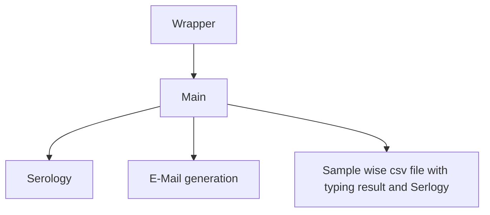

# hla-csv-generation

**Usage**
```python
python3 hla_service_automation_wrapper.py -h
```
- Place xlxs and csv file inside the input directory and wait for the mail


```mermaid
graph TD;
    A[Wrapper]-->B[Main];
    B-->C[Serology];
    B-->D[E-Mail generation];
    B-->E[Sample wise csv file with typing result and Serlogy];
```
Change
